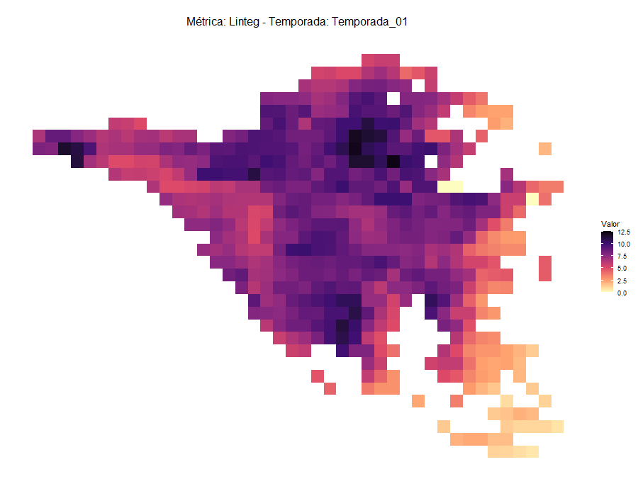
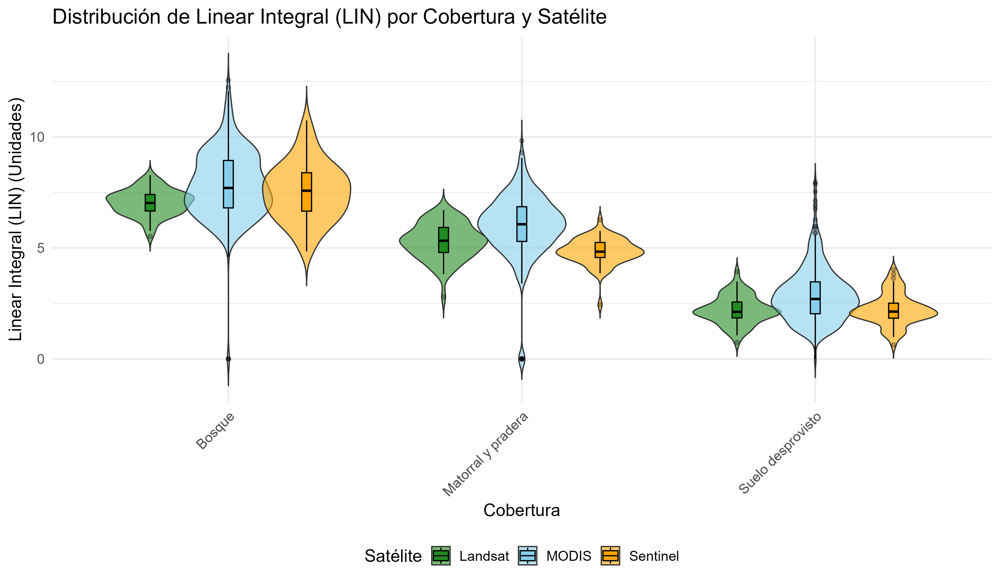
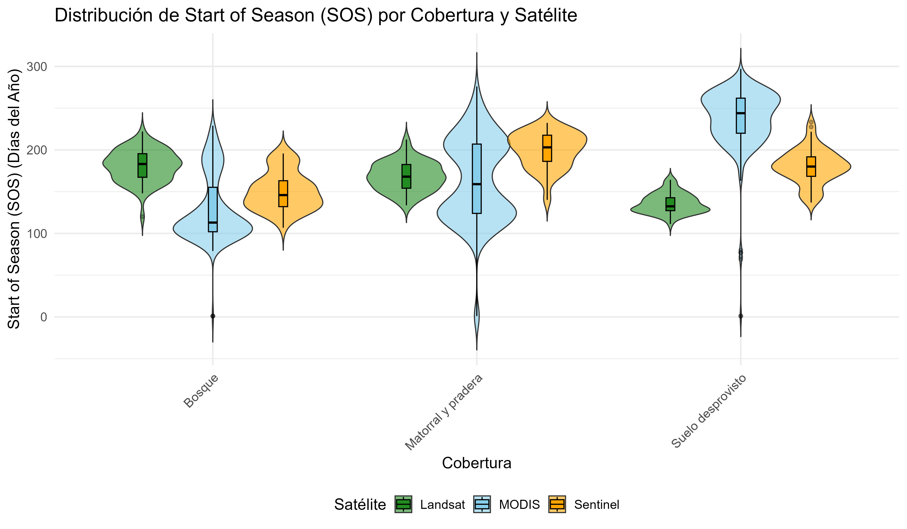
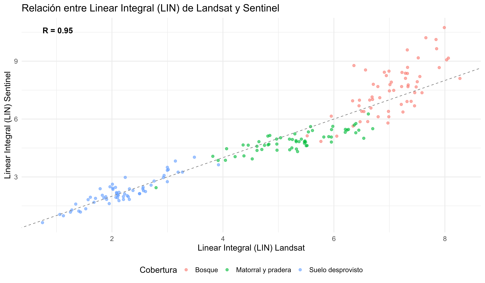
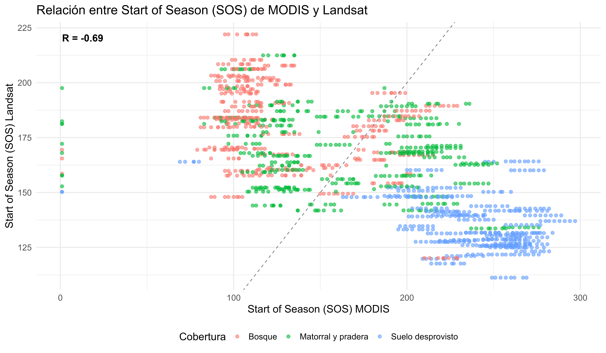
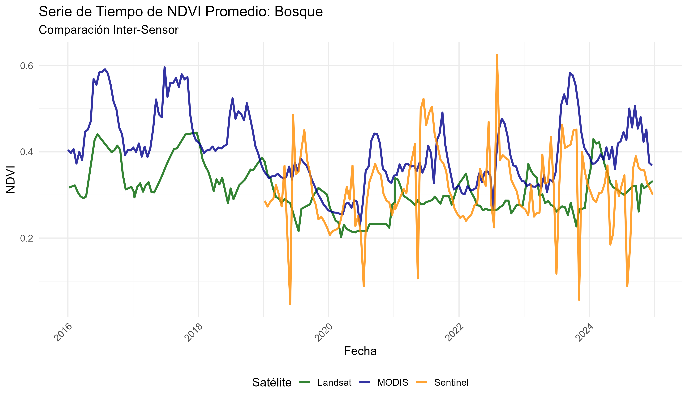

# Análisis Espaciotemporal de la Productividad Primaria del Bosque Esclerófilo en la Cuenca Aguas de Ramón

> **Residencia Profesional para optar al Título de Ingeniería Forestal** Facultad de Agronomía y Sistemas Naturales · Pontificia Universidad Católica de Chile

> **Autor:** Alfredo Agustín Coddou Díaz

> **Profesor Guía:** Dr. Marcelo Miranda \| **Profesora Co-guía e Informante:** Dra. Sara Acevedo

------------------------------------------------------------------------

## 🌍 Dinámica Fenológica Espaciotemporal

<div align="center">
  
  <br><br>
  <em>(Evolución espaciotemporal de la productividad primaria acumulada [LIN] en la cuenca capturada por MODIS, procesada a través de TIMESAT y visualizada dinámicamente).</em>
</div>

------------------------------------------------------------------------

## Conceptual framework

El bosque esclerófilo de la zona central de Chile enfrenta una presión crítica producto de la mega sequía (vigente desde 2010) y del fenómeno de pardeamiento (*browning*), lo que ha reducido su vigor y productividad primaria de forma acelerada.

Este repositorio se enfoca en evaluar la respuesta fenológica de la vegetación estratificada en **Bosque**, **Matorral y pradera**, y **Suelo desprovisto**, utilizando series de tiempo del índice NDVI (2016-2024). Para capturar estas dinámicas a múltiples escalas, se integran y comparan datos de tres sensores con resoluciones complementarias.

### Escalas de Observación (MODIS vs Landsat vs Sentinel)


*(Visualización de la escala de trabajo: la elección del sensor determina el nivel de detalle ecosistémico capturado. Un único píxel de MODIS integra la información espectral de ~69 píxeles de Landsat y ~625 píxeles de Sentinel).*

------------------------------------------------------------------------

## Objectives

### Objective 1 — Caracterizar la respuesta fenológica mediante series de tiempo NDVI

Extraer, limpiar y homogeneizar series de tiempo del índice NDVI derivadas de tres sensores satelitales en Google Earth Engine. Procesar estos datos mediante el algoritmo de suavizado Savitzky-Golay (TIMESAT) para aislar la señal fenológica y extraer métricas funcionales como el inicio de temporada (SOS), la duración (LOS), la amplitud (AMP) y la productividad acumulada (LIN).

### Objective 2 — Comparar las métricas fenológicas entre sensores por tipo de cobertura

Evaluar la convergencia y discrepancia entre MODIS, Landsat y Sentinel al estimar parámetros fenológicos sobre ecosistemas heterogéneos. Cuantificar el impacto de la resolución espacial en la detección del pardeamiento y la productividad primaria mediante análisis estadístico de varianza (Violines, Boxplots) y correlaciones cruzadas de Pearson (R).

------------------------------------------------------------------------

## Key outputs

### Modelado 3D de Cobertura Arbórea — Dynamic World & Rayshader


Render topográfico de alta calidad generado con `rayshader`. Muestra la probabilidad de cobertura arbórea (Google Dynamic World v1) proyectada sobre el modelo de elevación de la cuenca Aguas de Ramón.

------------------------------------------------------------------------

### Variabilidad Fenológica — Diagramas de Violín

| Linear Integral (Productividad Total) | Start of Season (Inicio de Temporada) |
|------------------------------------|------------------------------------|
|  |  |

Comparación de la distribución, densidad y estadística descriptiva (cuartiles) de las métricas fenológicas entre MODIS, Landsat y Sentinel, estratificadas por tipo de cobertura.

------------------------------------------------------------------------

### Comparación Inter-Sensor — Correlaciones y Series de Tiempo

| Source | Resolution | Output |
|------------------------|------------------------|------------------------|
| Landsat vs Sentinel | 30m vs 10m |  |
| MODIS vs Landsat | 250m vs 30m |  |
| Todos los sensores | Multiescalar |  |

*(Landsat y Sentinel presentan una altísima correlación R=0.95 en la estimación de la productividad total (LIN). La serie de tiempo unificada revela la caída crítica de productividad en 2020 producto de la mega sequía de 2019).*

------------------------------------------------------------------------

## Repository structure

```         
residencia_aguas_de_ramon/
│
├── 01_data/                          # Datos base y entradas del modelo
│   ├── raw/                          # Series NDVI crudas (.csv) extraídas de GEE
│   ├── raster/                       # Imágenes satelitales base e índices (.tif)
│   ├── timesat_txt/                  # Archivos .txt para ingreso manual a TIMESAT
│   └── vectorial/                    # Polígonos de cuenca, clasificación y grilla (.shp)
│
├── 02_scripts/                       # Flujo analítico principal
│   ├── 01_main.R a 07_...            # GEE, limpieza y extracción de series NDVI
│   ├── 08_... a 16_...               # Procesamiento de métricas TIMESAT y rasters
│   ├── 17_... a 19_...               # Muestreo estratificado cruzado (Grilla 250m)
│   └── 20_... a 24_...               # Análisis estadístico, plots y renderizado 3D
│
├── 03_results/                       # Salidas de datos procesados
│   ├── metricas_crudas/              # Exportaciones espaciales desde TIMESAT
│   ├── muestreo_espacial/            # Datos fenológicos intersectados por cobertura
│   ├── reducciones_*/                # Rasters espaciales de métricas fenológicas y GIFs
│   └── series_tiempo/                # Consolidado de series temporales promediadas
│
└── 04_plots/                         # Visualizaciones estáticas y cartografía
    ├── 3d_renders/                   # Modelos de elevación (Rayshader)
    ├── boxplots/                     # Diagramas de caja por métrica y sensor
    ├── densidades/                   # Curvas de distribución fenológica
    ├── relaciones/                   # Regresiones lineales y correlaciones (R)
    ├── series_tiempo/                # Comparativas longitudinales de NDVI
    ├── tablas/                       # Resúmenes estadísticos generados con gt
    └── violines/                     # Evaluación distribucional de fenología
```

------------------------------------------------------------------------

## Execution order

```         
# Step 1 — Extracción de series de tiempo (requiere GEE)
02_scripts/01_main.R a 07_extraccion_series_sentinel.R

# Step 2 — Reducción y visualización dinámica de métricas TIMESAT
02_scripts/08_metricas_modis.R a 16_s_visualizacion_metricas.R

# Step 3 — Muestreo espacial estratificado y unificación
02_scripts/17_muestreo_modis.R
02_scripts/18_muestreo_landsat.R
02_scripts/19_muestreo_sentinel.R

# Step 4 — Análisis estadístico y visualización estática (no requiere GEE)
02_scripts/20_plots_muestreo.R         -> 04_plots/boxplots/, densidades/, tablas/
02_scripts/21_plots_timeseries.R       -> 04_plots/series_tiempo/
02_scripts/22_plots_violin.R           -> 04_plots/violines/

# Step 5 — Renderizado Topográfico 3D (requiere GEE)
02_scripts/24_3d_visualizacion.R       -> 04_plots/3d_renders/
```

------------------------------------------------------------------------

## Data sources

| Source | Description | Resolution | Date / Period |
|------------------|------------------|------------------|------------------|
| [MODIS MOD13Q1 v6](https://developers.google.com/earth-engine/datasets/catalog/MODIS_061_MOD13Q1) | NDVI Time Series | 250m / 16-day | 2016 - 2024 |
| [Landsat 8 C2 T1 L2](https://developers.google.com/earth-engine/datasets/catalog/LANDSAT_COMPOSITES_C02_T1_L2_8DAY_NDVI) | NDVI 8-Day Composite | 30m / 16-day | 2016 - 2024 |
| [Sentinel-2 MSI Level-2A](https://developers.google.com/earth-engine/datasets/catalog/COPERNICUS_S2_SR_HARMONIZED) | Harmonized NDVI | 10m / 5-day | 2019 - 2024 |
| [Google Dynamic World v1](https://developers.google.com/earth-engine/datasets/catalog/GOOGLE_DYNAMICWORLD_V1) | Tree cover probabilities | 10m | 2024 |
| [CONAF](https://www.conaf.cl) | Catastro de Recursos Vegetacionales | Vector | 2024 |

------------------------------------------------------------------------

## GEE setup

Para ejecutar los scripts de extracción (01-07) y renderizado 3D (24), es necesario autenticar la sesión de Google Earth Engine mediante el paquete `rgee`:

```         
library(rgee)
ee_Authenticate(user = "your_username")
ee_Initialize(
  user    = "your_username",
  drive   = TRUE
)
```

------------------------------------------------------------------------

## Citation & Acknowledgements

**Alfredo Agustín Coddou Díaz** · Pontificia Universidad Católica de Chile\
Proyecto de título desarrollado bajo la guía del **Dr. Marcelo Miranda**.

Un agradecimiento especial a la **Dra. Sara Acevedo**, co-guía e informante de este proyecto. Su rol como mentora en programación espacial y su rigurosa metodología de trabajo en R fueron la inspiración directa para la arquitectura, reproducibilidad y orden de este repositorio.
